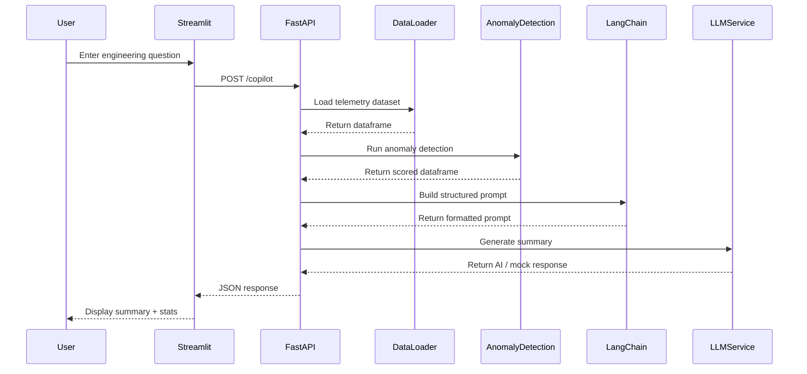
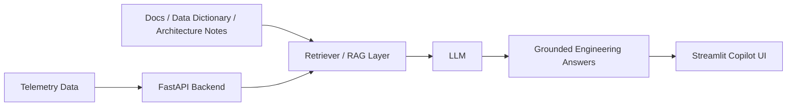

# AI Telemetry Copilot

A telemetry monitoring platform that processes engineering sensor data, detects anomalies, and exposes results through APIs and a simple dashboard.

This project is being developed as a step toward integrating AI and LLM capabilities into engineering data systems.

---

## Current Features

- Telemetry data ingestion from processed datasets
- Anomaly detection using Isolation Forest
- FastAPI backend exposing telemetry and anomaly endpoints
- Streamlit dashboard for basic data visualization
- Modular architecture ready for AI/LLM integration

---

## Tech Stack

- Python
- FastAPI
- Pandas / NumPy
- Scikit-learn
- Streamlit

---

## Project Structure


---

## How to Run the Project

### 1. Clone the repository
```bash
git clone https://github.com/YOUR_USERNAME/ai-telemetry-copilot.git
cd ai-telemetry-copilot
```

### 2. Create a virtual environment
```bash
python -m venv .venv
source .venv/bin/activate   # macOS/Linux
# .venv\Scripts\activate    # Windows
```

### 3. Install dependencies
```bash
pip install -r requirements.txt
```

### 4. Add sample data
Make sure you have a CSV file at:
```text
data/processed/telemetry_processed.csv
```

### 5. Run the FastAPI backend
```bash
uvicorn backend.main:app --reload
```

Open in your browser:
```text
http://127.0.0.1:8000/docs
```

### 6. Run the Streamlit dashboard
```bash
streamlit run app/streamlit_app.py
```


## Architecture

The application follows a simple but production-style flow:

**Telemetry Data → Backend Analytics → AI Copilot → Frontend UI**

### High-Level Architecture

```mermaid
flowchart LR
    A[Processed Telemetry Data CSV] --> B[FastAPI Backend]

    B --> C[Data Loader Service]
    B --> D[Anomaly Detection Service]
    B --> E[LangChain Prompt Builder]
    B --> F[LLM Service]

    F --> G[Mock Mode]
    F --> H[Real LLM Mode<br/>OpenAI / Azure OpenAI]

    B --> I[REST API Endpoints]

    I --> J[/health]
    I --> K[/telemetry]
    I --> L[/anomalies]
    I --> M[/copilot]

    M --> N[Engineering Summary + Stats]

    O[Streamlit UI] --> I
    I --> O
```

---

## Component Breakdown

### 1. Data Layer
The application starts from a processed telemetry dataset:

- `data/processed/telemetry_processed.csv`

This simulates telemetry coming from a real engineering system such as:

- industrial equipment
- IoT devices
- building systems
- aircraft / engine telemetry

---

### 2. Backend API Layer
The backend is built with **FastAPI** and acts as the core application layer.

It is responsible for:

- loading telemetry data
- running anomaly detection
- computing summary statistics
- preparing AI prompts
- exposing REST endpoints for the frontend

Main entry point:

- `backend/main.py`

---

### 3. Service Layer
The backend logic is split into reusable services:

#### `data_loader.py`
Loads the processed telemetry dataset from disk.

#### `anomaly_detection.py`
Runs anomaly detection using **Isolation Forest** and flags abnormal records.

#### `langchain_chain.py`
Builds a structured engineering-style prompt from telemetry statistics.

#### `llm_service.py`
Handles the summary generation layer with support for:

- mock mode for free local development
- real LLM mode for future OpenAI / Azure OpenAI integration

---

### 4. API Endpoints

#### `/health`
Used to verify the backend is running correctly.

#### `/telemetry`
Returns telemetry rows for inspection and frontend display.

#### `/anomalies`
Returns rows flagged as anomalous by the ML model.

#### `/copilot`
Combines:

- telemetry loading
- anomaly scoring
- summary statistics
- prompt construction
- AI summary generation

This is the main intelligence endpoint of the application.

---

### 5. Frontend Layer
The frontend is built with **Streamlit**.

It provides:

- telemetry table preview
- sensor visualization
- copilot question input
- generated engineering summary
- summary statistics display

File:

- `app/streamlit_app.py`

This makes the project feel like a usable product rather than a set of scripts or API calls.

---

## Request Flow

### Copilot Flow



---

## Design Principles

This project is intentionally structured to reflect real-world engineering and AI system design:

- **Modular**: each responsibility is separated into routes, services, and UI
- **Explainable**: anomaly statistics are exposed alongside AI-generated summaries
- **Extensible**: mock mode can later be replaced with real LLM providers
- **Frontend + Backend**: combines analytics APIs with a lightweight UI
- **AI-Ready**: structured for future RAG and enterprise LLM integration

---

## Why Streamlit?

Streamlit is used as the presentation layer to make the backend usable through a browser.

Without Streamlit, the project would only expose APIs through Swagger.  
With Streamlit, the project becomes a lightweight interactive application where users can:

- inspect telemetry data
- visualize sensor behavior
- ask engineering questions
- receive natural-language summaries

This improves usability and makes the system easier to demonstrate to recruiters and hiring managers.

---

## Future AI Extension

The current architecture is designed to support the next step:

- **real LLM integration**
- **retrieval-augmented generation (RAG)**
- **sensor metadata search**
- **architecture-aware engineering Q&A**

Future architecture direction:



Then open:
```text
http://localhost:8501
```

