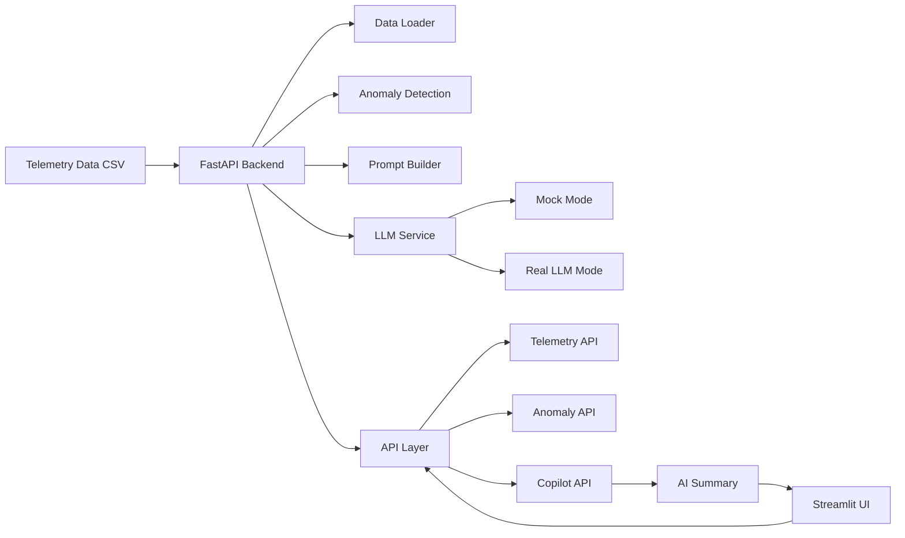
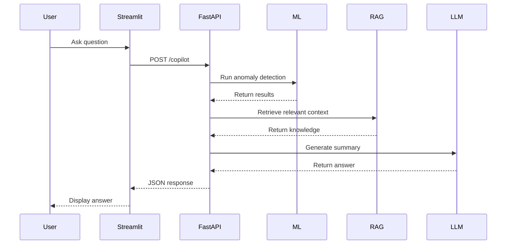

# AI Telemetry Copilot

An AI-powered telemetry monitoring system that detects anomalies in engineering sensor data and provides natural-language insights using a Retrieval-Augmented Generation (RAG) pipeline.

---

## 🚀 Overview

This project simulates a real-world engineering analytics system where telemetry data is:

- processed and analyzed
- evaluated for anomalous behavior
- exposed via APIs
- summarized using AI
- queried through a chat-style UI

The system combines **machine learning**, **backend APIs**, **LLM integration**, and **RAG** to deliver context-aware engineering insights.

---

## 🧠 Key Features

- 📊 Telemetry data ingestion from CSV
- 🤖 Anomaly detection using Isolation Forest
- ⚡ FastAPI backend with structured endpoints
- 🧩 Modular service architecture
- 🧠 LLM integration (mock + real-ready)
- 📚 Retrieval-Augmented Generation (RAG)
- 💬 Chat-style AI copilot interface (Streamlit)
- 📈 Sensor visualization dashboard

---

## 🏗️ Architecture



---

## 🔄 Copilot Flow



---

## 📦 Tech Stack

- **Python**
- **FastAPI**
- **Pandas / NumPy**
- **Scikit-learn**
- **LangChain (prompt layer)**
- **OpenAI (optional LLM)**
- **Streamlit (UI)**

---

## 📂 Project Structure

```
backend/
  routes/        # API endpoints
  services/      # data, ML, LLM, RAG logic

app/
  streamlit_app.py   # UI

data/
  processed/         # telemetry dataset

docs/
  data_dictionary.md # RAG knowledge base
```

---

## ▶️ How to Run

### 1. Clone repo
```bash
git clone https://github.com/YOUR_USERNAME/ai-telemetry-copilot.git
cd ai-telemetry-copilot
```

### 2. Create environment
```bash
python -m venv .venv
source .venv/bin/activate
```

### 3. Install dependencies
```bash
pip install -r requirements.txt
```

### 4. Run backend
```bash
uvicorn backend.main:app --reload
```

### 5. Run UI
```bash
python -m streamlit run app/streamlit_app.py
```

---

## 💬 Example Questions

- What does sensor_3 represent?
- Explain anomaly detection method
- Summarize anomaly situation
- What appears abnormal in the system?

---

## 🧠 RAG (Retrieval-Augmented Generation)

The system enhances responses by retrieving domain-specific knowledge from:

```
docs/data_dictionary.md
```

This allows the copilot to:
- explain sensors
- describe anomaly logic
- provide engineering context
- go beyond raw statistics

---

## ⚙️ LLM Modes

The system supports two modes:

### Mock Mode (default)
- no cost
- deterministic summaries

### Real LLM Mode
Set in `.env`:

```
USE_LLM=true
OPENAI_API_KEY=your_key
```

---

## 📸 UI Preview

*(Add screenshots here later)*

---

## 🚧 Future Improvements

- Vector-based retrieval (FAISS / embeddings)
- Time-series anomaly detection
- Multi-source telemetry ingestion
- Azure OpenAI integration
- Advanced engineering reasoning

---

## 🎯 Why This Project Matters

This project demonstrates:

- backend system design
- ML integration
- LLM integration
- RAG implementation
- UI/UX thinking

It reflects how modern **AI-powered engineering systems** are built.

---

## 📌 Status

✅ Fully functional  
🚀 AI + RAG system complete  
